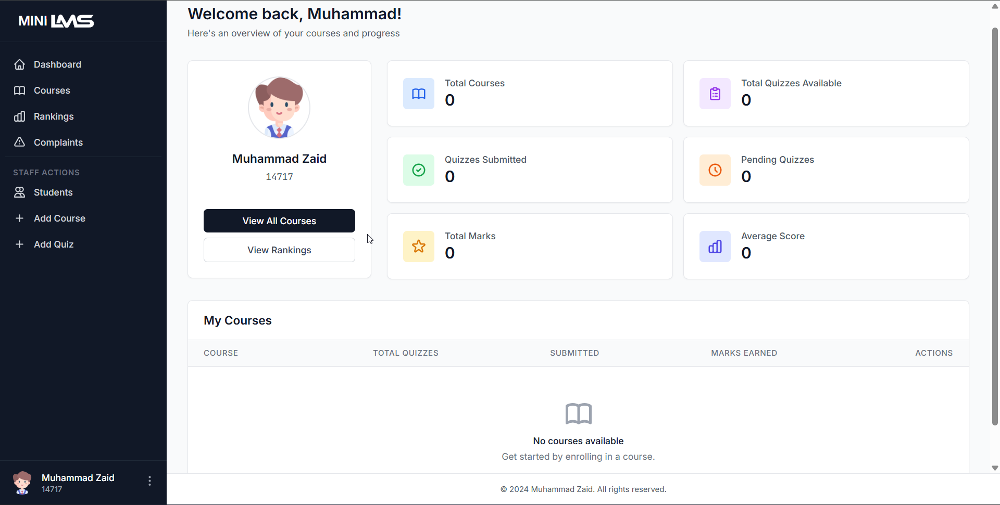
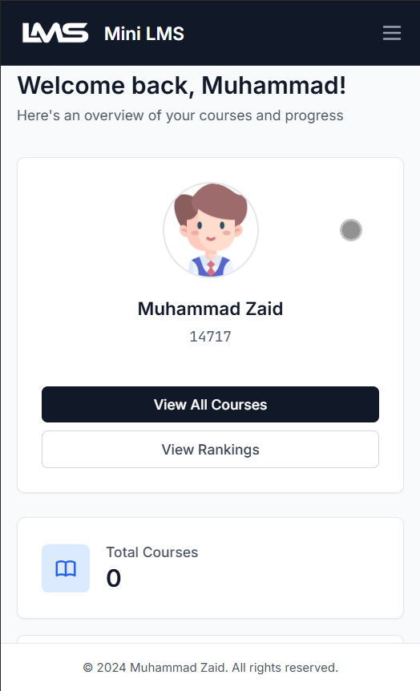
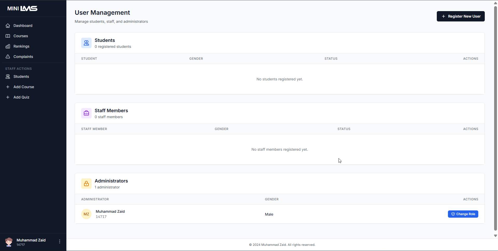

# mini LMS | QMS

Mini LMS (Learning Management System) or you can say QMS (Quiz Management System) is a Django-based web application that helps manage educational resources and activities. This project is designed to streamline course management and enhance learning experiences.

## Project Purpose and Background

This project was initially created as a practice exercise to explore web development with Django. Over time, it evolved into a functional platform for university classmates, providing a space to take quizzes, solve coding challenges, and prepare for exams effectively.

# WEB INTERFACE


# MOBILE INTERFACE



## Features

- **User Authentication and Management**
  - Secure user registration and login system
  - Role-based access control with three user types
  - User profile management with gender-specific avatars
  - Account suspension/activation functionality

- **Course and Quiz Management**
  - Create and manage multiple courses
  - Quiz creation with file attachments (help files)
  - Due date tracking and submission deadlines
  - Support for multiple file types (PDF, DOC, DOCX, ZIP, TXT, CPP, PY)

- **Enhanced Dashboard**
  - Six informative metric cards showing:
    - Total Courses
    - Quizzes Submitted
    - Total Marks
    - Total Quizzes Available
    - Pending Quizzes
    - Average Score
  - Responsive design for mobile and desktop
  - Real-time progress tracking

- **Grading and Feedback System**
  - Staff can grade submissions with marks (0-10 scale)
  - Add detailed remarks/feedback for each submission
  - Students can view their grades and instructor feedback
  - Automatic mark calculation and aggregation

- **Ranking System**
  - Overall student rankings based on total marks
  - View your current rank position
  - Compare performance with peers

- **Complaint System**
  - Students can submit complaints/feedback
  - Staff can view and manage all complaints

- **User Role System**
  - **Administrator (Superuser)**: Only one administrator, created via Django command. Has full system access and cannot be modified through UI
  - **Staff/Instructor**: Can manage courses, quizzes, grade submissions, view all student data, and register new users
  - **Student**: Can view courses, submit quizzes, view grades, check rankings, and submit complaints

---

## Users


## Installation Instructions

### Prerequisites
Ensure you have the following installed on your system:

- Python 3.8+
- pip (Python package installer)
- Virtualenv (optional but recommended)

### Step-by-Step Guide

#### 1. Clone the Repository
```bash
git clone https://github.com/your-username/Mini-LMS.git
cd Mini-LMS
```

#### 2. Set Up a Virtual Environment (Optional but Recommended)
```bash
pip install virtualenv # to install virtual environment
python -m venv .venv # to create virtual environment
.venv\Scripts\activate  # to activate venv On Windows
```

#### 3. Install Dependencies
```bash
pip install -r requirements.txt
```

#### 4. Configure Environment Variables
Create a `.env` file in the project root directory:
```bash
cp .env.example .env
```

Edit the `.env` file and configure the following variables:
- `SECRET_KEY`: Django secret key (generate a new one for production)
- `DEBUG`: Set to `True` for development, `False` for production
- `ALLOWED_HOSTS`: Comma-separated list of allowed hosts
- Email configuration (optional, for notifications)

#### 5. Run Database Migrations
```bash
python manage.py makemigrations
python manage.py migrate
```

#### 6. Create a Superuser/Administrator
**Important:** There should be only ONE administrator account. Create it using Django's command:
```bash
python manage.py createsuperuser
```

Follow the prompts to set up a username, password, and email. This will be your main administrator account.

**Note:** Additional users (Students and Staff) should be registered through the web interface by the administrator or staff members.

#### 7. Start the Development Server
```bash
python manage.py runserver
```

Visit the application at [http://127.0.0.1:8000/](http://127.0.0.1:8000/).

---

## User Roles and Permissions

### Administrator (Superuser)
- **Creation**: Must be created via Django command (`python manage.py createsuperuser`)
- **Quantity**: Only ONE administrator should exist in the system
- **Permissions**: Full system access - manage all users, courses, quizzes, and system settings
- **Restrictions**: Cannot be created or modified through the web interface


### Staff/Instructor
- **Creation**: Registered through the web interface by administrators or other staff members
- **Permissions**:
  - Create and manage courses
  - Create and manage quizzes
  - Grade student submissions
  - Add remarks/feedback
  - View all student data
  - Register new students and staff
  - Manage user roles (Student ↔ Staff only)
- **Restrictions**: Cannot modify administrator accounts

### Student
- **Creation**: Registered through the web interface by administrators or staff members
- **Permissions**:
  - View enrolled courses
  - Submit quizzes before deadlines
  - View their own grades and feedback
  - Check their ranking
  - Submit complaints/feedback
- **Restrictions**: Cannot access administrative functions

---

## Project Structure

```
Mini-LMS/
├── base/               # Base templates and utilities
├── studybud/           # Core application logic
├── db.sqlite3          # SQLite database file
├── manage.py           # Django management script
|── LICENSE             # MIT LICENSE
└── requirements.txt    # Python dependencies
```

---

## Contributing

Contributions are welcome! Please fork this repository, create a feature branch, and submit a pull request.

---

## License

This project is licensed under the MIT License. See the `LICENSE` file for details.